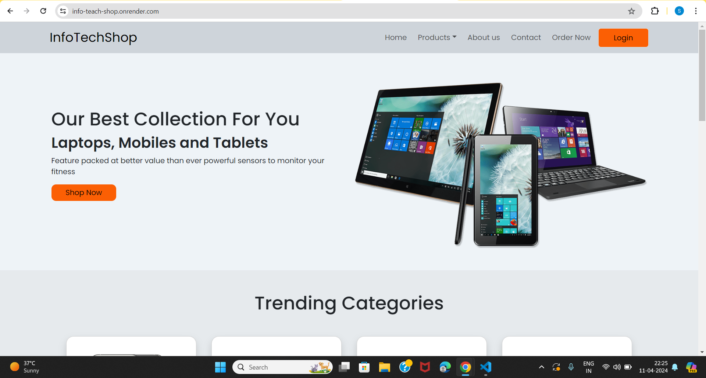
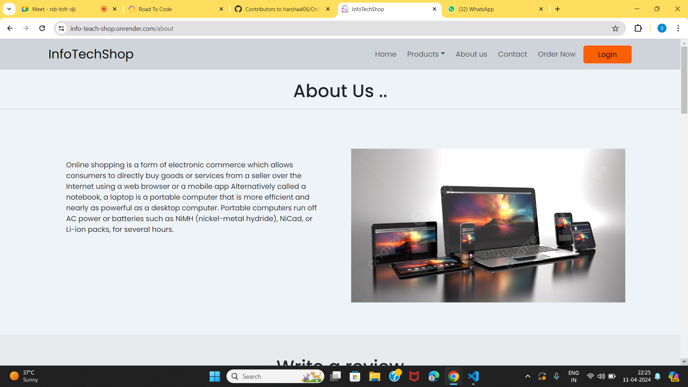
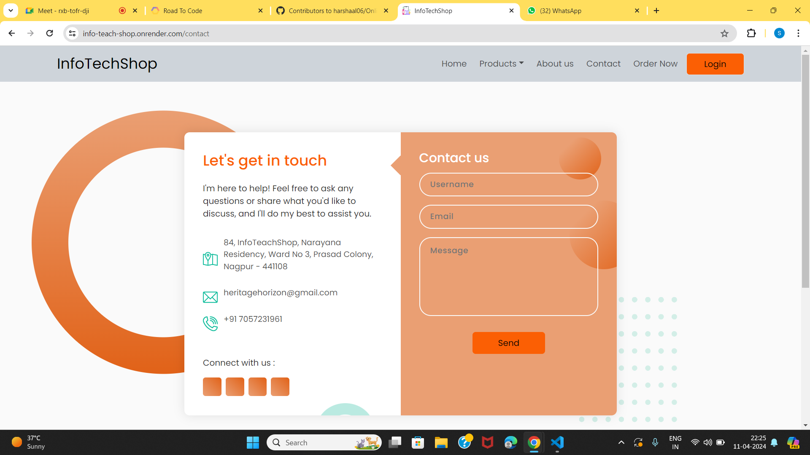
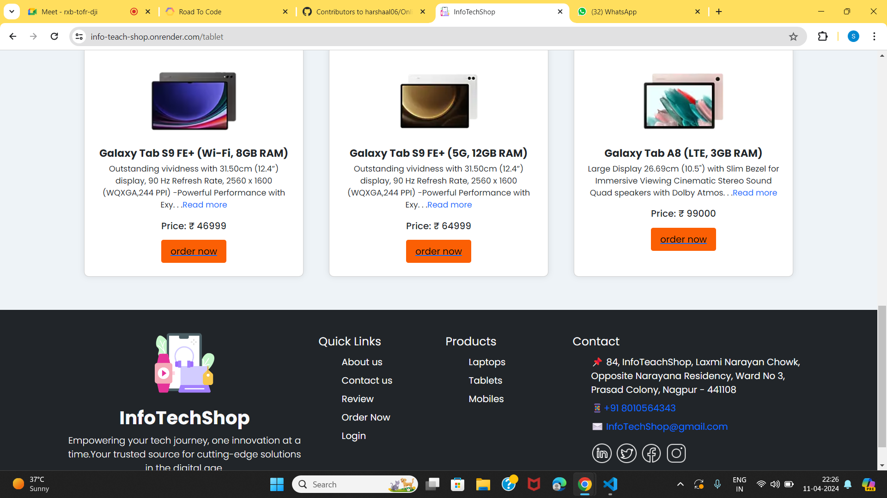
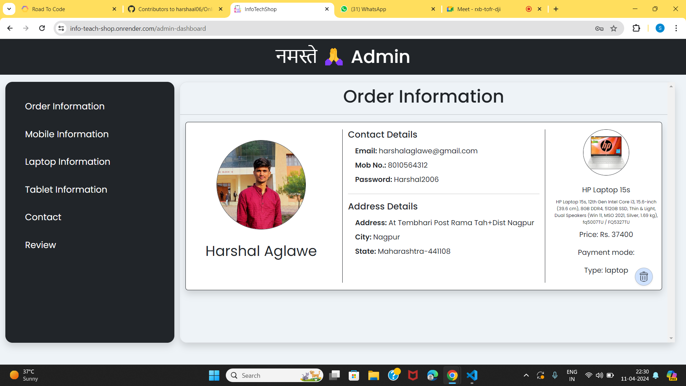

# icp-6-group-1-FullStack-Project

## Tagline
Empower Your Life with InfoTechShop Technology

## URL
https://info-teach-shop.onrender.com/

## Screenshots

## Use of Project
This project serves as the foundation for an e-commerce website specializing in the sale of electronic gadgets. With a focus on providing cutting-edge technology to our customers, our website aims to enhance lifestyles with the latest innovations in electronics.

## Description
Welcome to InfoTechShop, your ultimate destination for purchasing high-quality electronic gadgets! Our platform offers a wide range of cutting-edge gadgets, ranging from smartphones and tablets to smartwatches and home appliances.

## Real Life Use
InfoTechShop offers a wide range of electronic gadgets tailored for various purposes:

- *Personal Use:* Upgrade your personal electronic devices with the latest smartphones, laptops, headphones, and more.
  
- *Professional Use:* Boost productivity with high-performance workstations, ergonomic peripherals, and innovative software solutions.
  
- *Gift Shopping:* Find the perfect gift for any occasion from our selection of customizable tech accessories, smartwatches, gaming consoles, and home automation devices.
  
- *Tech Enthusiasts:* Stay ahead of the curve with groundbreaking gadgets like virtual reality headsets, drones, smart home devices, and futuristic wearables.

## Future Scope
Product Range Expansion: Introduce new categories like smart home devices, audio accessories, and gaming peripherals to attract a wider customer base and become a comprehensive tech hub.

Advanced Technology Integration: Implement AI and ML technologies for enhanced user experience. Features like AI chatbots for customer support, personalized product recommendations, and AR-based virtual try-ons can elevate your website's appeal and foster customer loyalty.